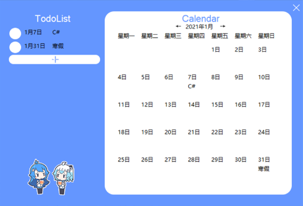
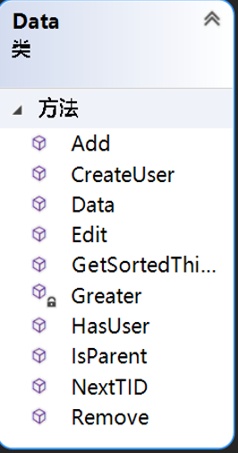
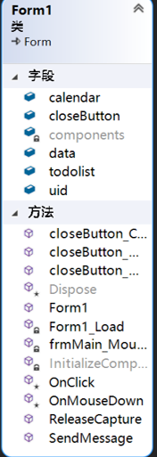
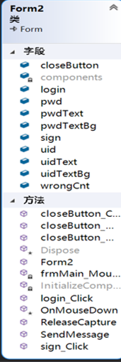
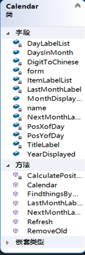

## To-do List Platform on Windows

**C# Programming and Application 2021 Final Project**

#### Demo

For full demo, download the files and visit Todolist/bin/Debug/Todolist.exe

#### Object-oriented Programming Structures

      

#### Project Description

1. Improve the shortcomings of similar software on the market: we are intuitive, fast and easy-to-use

2. To-do List and calendar display together
3. Support multi-user mode, use account and password to log in
4. Well-designed user interface by Photoshop
5. The back-end database structure is clear and conducive for future versions and has good scalability. All using C# language for object-oriented programming.

#### Teamwork

Haoxiang Yang

Wenhao Li

Meng Sun